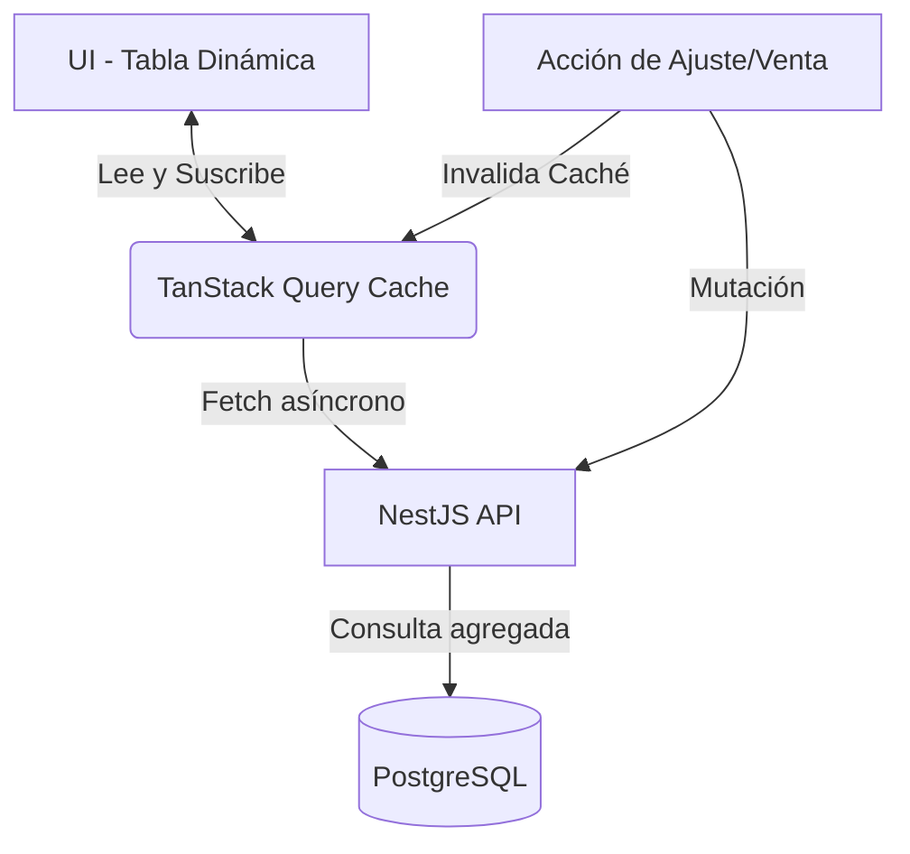

# INFORME TÉCNICO DE IMPLEMENTACIÓN: CONTROL DE STOCK EN VIVO
## Implementación de Tablas Dinámicas y Gestión de Existencias en Tiempo Real

**Documento Técnico - Sistema ERP E-Commerce**  
**Fecha:** 20 de Junio de 2026  
**Tecnologías:** Next.js (Frontend), TanStack Query (React Query), NestJS (Backend), Prisma ORM (Base de Datos)

---

## 1. Objetivo de la Implementación

El objetivo central de este módulo es dotar al sistema de una **visibilidad exacta y reactiva del inventario**. Esto significa permitir a los administradores visualizar, auditar y gestionar las existencias de los productos de forma inmediata y **sin necesidad de recargar la página**.

Específicamente, la implementación busca:
- **Tablas Dinámicas Reactivas:** Proveer una interfaz de cuadrícula (Grid/Table) que se actualiza asíncronamente y soporta búsqueda y ordenamiento instantáneo en el cliente.
- **Trazabilidad Absoluta (Kardex):** Mantener un historial inmutable de cada entrada, salida, transferencia o ajuste de inventario, asegurando que el stock físico siempre coincida con el lógico.
- **Prevención de Errores Logísticos:** Evitar mediante reglas de negocio a nivel de base de datos que existan saldos negativos en los almacenes.

---

## 2. Arquitectura y Gestión de Estado (Tiempo Real)

Para lograr la experiencia de "tiempo real sin recargar", el sistema abandona el modelo tradicional de peticiones síncronas y adopta un modelo basado en caché y revalidación:

- **TanStack Query (React Query):** Se utiliza para la gestión del estado asíncrono del servidor en el frontend. Mantiene en memoria (`queryKey: ["products", workspaceId]`) la data de los productos y su stock. Cuando ocurre un movimiento, la caché se revalida automáticamente, redibujando la tabla sin parpadeos ni recargas de navegador.

---

## 3. Motor del Inventario (Backend)

La lógica de existencias está encapsulada en el `InventoryService` de NestJS. Es un componente crítico que maneja la concurrencia y la integridad de los datos.

### Especificaciones Técnicas (Transacciones Atómicas):
El método central `updateStock` ejecuta una **transacción de Prisma (`$transaction`)** que garantiza que dos operaciones ocurran juntas o no ocurran:
1. **Actualización del Saldo:** Busca el registro en la tabla `inventory` para el par `(product_id, warehouse_id)`. Si existe, incrementa o decrementa mediante la operación atómica `increment`. Si no existe, lo crea.
2. **Validación de Stock Negativo:** Verifica en memoria transaccional que el resultado final del stock no sea menor a 0. Si lo es, revierte toda la operación lanzando una `BadRequestException`.
3. **Registro en Kardex:** Inserta un nuevo registro en `stock_movements` (Kardex) detallando la cantidad exacta, tipo de movimiento (`IN`, `OUT`, `ADJUSTMENT`, `TRANSFER`) y el motivo.

---

## 4. Interfaz de Usuario y Tablas Dinámicas

La vista principal de inventario (`/workspaces/[workspaceId]/inventory`) está diseñada para alto rendimiento, manejando la carga de datos sin bloquear la interacción del usuario.

### Características de la Tabla:
- **Estados de Carga Elegantes:** Uso de `Skeleton` loaders que simulan la estructura de la tabla mientras TanStack Query resuelve la petición de red en segundo plano.
- **Filtros Locales:** Búsqueda en tiempo real por Nombre o SKU iterando sobre el estado local, lo que da una respuesta de 0 milisegundos.
- **Ordenamiento Interactivo:** Función `toggleSort` que permite ordenar columnas numéricas (como el Precio) o alfabéticas (como el Nombre) de forma ascendente o descendente al hacer clic en las cabeceras.
- **Agregación de Saldos:** El stock total visible en la tabla es el resultado de la suma (`reduce`) de las existencias del producto a través de todos los almacenes activos (`p.inventory.reduce(...)`).

---

## 5. Propuesta de Capturas de Pantalla en el Informe

Para documentar adecuadamente esta interfaz frente al usuario final o equipo de calidad, se recomiendan las siguientes capturas:

#### A. Dashboard Superior y Resumen de Stock
> **Descripción de la Captura:** Las tarjetas superiores (Cards) de la página de inventario.
> 
> **Elementos Clave a Mostrar:**
> - Tarjeta "Total Productos" (indicando cantidad de productos activos).
> - Tarjeta "Almacenes" (ubicaciones de stock operativas).
> - Tarjeta "Unidades Totales" (la sumatoria global de todo el stock físico).

#### B. Tabla Dinámica en Estado de Búsqueda
> **Descripción de la Captura:** La cuadrícula principal filtrada mediante la barra de búsqueda rápida.
> 
> **Elementos Clave a Mostrar:**
> - El campo de texto "Buscar productos..." con un término ingresado (ej: "Laptop").
> - La tabla mostrando únicamente los productos que coinciden, con su SKU, precio y **Stock Total** resaltado en negrita.
> - La columna de cabecera con el icono de ordenamiento (`ArrowUpDown`) indicando que es interactiva.

#### C. Historial de Kardex (Visor de Movimientos)
> **Descripción de la Captura:** El modal emergente (Dialog) que se abre al hacer clic en el botón "Kardex" de un producto específico, mostrando el componente `KardexView`.
> 
> **Elementos Clave a Mostrar:**
> - Título del modal que indica el nombre del producto seleccionado.
> - Tabla de historial que muestra la fecha exacta, el almacén donde ocurrió el movimiento, y el Tipo de movimiento acompañado de iconos y códigos de color (Verde para Entradas `IN`, Rojo para Salidas `OUT`).
> - La columna de "Razón" detallando por qué cambió el stock (ej. "Stock inicial al crear producto").

#### D. Estado Vacío (Empty State)
> **Descripción de la Captura:** La vista que se muestra cuando la búsqueda no produce resultados o cuando no hay productos creados aún.
> 
> **Elementos Clave a Mostrar:**
> - Icono central de una caja vacía (`Package`) semi-transparente.
> - El mensaje amigable "No hay resultados" invitando al usuario a intentar con otro término de búsqueda.

---

## 6. Auditoría y Prevención

Este diseño prioriza la precisión. Al separar el saldo total (que es dinámico y calculable) del registro inmutable (Kardex), el sistema garantiza que cualquier descuadre de inventario pueda ser rastreado hasta el segundo exacto, el usuario responsable y el almacén físico específico donde ocurrió la discrepancia.
