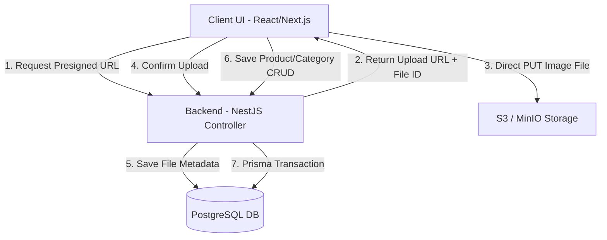

# INFORME TÉCNICO DE IMPLEMENTACIÓN: GESTIÓN DE PRODUCTOS (CRUD)
## Creación del Catálogo Maestro (Productos, Categorías e Imágenes)

**Documento Técnico - Sistema ERP E-Commerce**  
**Fecha:** 19 de Junio de 2026  
**Tecnologías:** Next.js (Frontend), NestJS (Backend), Prisma ORM (Base de Datos), S3 (Almacenamiento)

---

## 1. Objetivo de la Implementación

El objetivo principal de este módulo es proporcionar al usuario administrador un sistema robusto, rápido y escalable para la gestión de su **Catálogo Maestro**. Esto permite centralizar la información de los productos que se comercializan, clasificándolos por categorías y dotándolos de material gráfico (imágenes de producto), así como establecer los saldos iniciales de inventario de forma controlada.

Específicamente, la implementación busca:
- **Centralizar el Catálogo:** Registrar el nombre, código SKU (único por espacio de trabajo), descripción técnica y precios (venta y costo) de los artículos.
- **Clasificación Semántica:** Agrupar los artículos en categorías personalizables para optimizar las búsquedas y la generación de reportes analíticos de ventas.
- **Gestión Eficiente de Media:** Implementar un flujo de carga de imágenes optimizado que no sature el servidor backend, utilizando almacenamiento en la nube (S3 / MinIO) a través de cargas directas desde el cliente con URLs firmadas (Presigned URLs).
- **Control de Inventario Inicial:** Conectar la creación del producto con el registro del stock inicial en un almacén específico, generando de forma automática su respectivo movimiento en el historial de Kardex.

---

## 2. Arquitectura General y Flujo de Datos

El sistema se compone de una arquitectura en capas:

---

## 3. Gestión de Categorías

Las categorías permiten estructurar y segmentar el catálogo. Se gestionan mediante un CRUD simple que requiere un nombre único dentro del espacio de trabajo (*Workspace*).

### Especificaciones Técnicas:
- **Backend:** `CategoriesController` y `CategoriesService` manejan las operaciones CRUD en la tabla `categories` mediante Prisma. Cada acción de creación, actualización o eliminación genera un registro en la tabla de auditoría (`audit_logs`).
- **Frontend:** Componente `CategoryForm` implementado con `react-hook-form` y validación de campos.

### Propuesta de Capturas de Pantalla en el Informe:

#### A. Listado y Control de Categorías
> **Descripción de la Captura:** Una vista general de la sección "Categorías" donde se muestra la tabla con los nombres y descripciones de las categorías existentes, junto con los botones de acción para editar y eliminar.
> 
> **Elementos Clave a Mostrar:**
> - El botón "Nueva Categoría" en la parte superior derecha.
> - La tabla ordenada alfabéticamente por nombre de categoría.
> - El diseño de la interfaz consistente con el tema (claro/oscuro).

#### B. Modal de Registro / Edición de Categoría
> **Descripción de la Captura:** El diálogo emergente (`Dialog`) que contiene el formulario `CategoryForm`.
> 
> **Elementos Clave a Mostrar:**
> - Campo de entrada para el **Nombre** (con asterisco indicando obligatoriedad).
> - Campo de texto multilínea para la **Descripción** (opcional).
> - Mensajes de validación de campo vacío si el usuario intenta enviar el formulario sin nombre.
> - El botón de confirmación ("Crear Categoría" o "Actualizar").

---

## 4. Gestión de Productos (CRUD de Catálogo Maestro)

El módulo de productos es el componente central de la gestión logística. Su creación requiere asociar información financiera, logística y de clasificación.

### Especificaciones Técnicas:
- **Backend:** `ProductsService` gestiona la lógica de persistencia. La creación del producto se realiza bajo una **transacción de base de datos** (`prisma.$transaction`) que asegura la consistencia de los datos:
  1. Registra el producto básico en la tabla `products`.
  2. Si se ingresa stock inicial, crea el registro en la tabla `inventory` vinculando el producto con el `warehouse_id`.
  3. Crea un movimiento en la tabla `stock_movements` (tipo `IN`, motivo `"Stock inicial al crear producto"`) para alimentar el Kardex.
  4. Valida que el código SKU no esté duplicado en el mismo workspace.
- **Frontend:** Componente `ProductForm` que recopila la información del producto. Cuenta con una opción "Crear y agregar otro" para optimizar el registro masivo.

### Propuesta de Capturas de Pantalla en el Informe:

#### A. Listado Maestro de Productos (Catálogo)
> **Descripción de la Captura:** La vista principal de la ruta `/workspaces/[workspaceId]/products`.
> 
> **Elementos Clave a Mostrar:**
> - Buscador de productos en tiempo real por Nombre o SKU.
> - Selector/Filtro por Categorías.
> - Grid o tabla de productos mostrando: Imagen miniatura, Nombre del producto, SKU, Categoría asociada, Stock actual (agregado de almacenes), Precio de venta, y los botones para Ver Kardex, Editar o Eliminar.
> - Botones rápidos para acceder a "Categorías" y "Almacenes".

#### B. Formulario de Creación de Producto (Campos Generales y Logísticos)
> **Descripción de la Captura:** El modal `ProductForm` abierto en modo de creación ("Nuevo Producto").
> 
> **Elementos Clave a Mostrar:**
> - Selector de **Almacén** (obligatorio si se establece stock inicial para asignarle ubicación física al saldo).
> - Campos básicos de texto: **Nombre del Producto**, **SKU / Código** y **Categoría** (dropdown dinámico cargado desde el backend).
> - Área de texto para **Descripción** de detalles técnicos.

#### C. Sección Financiera (Precios y Costos)
> **Descripción de la Captura:** La sección inferior del formulario de productos donde se ingresan los valores monetarios.
> 
> **Elementos Clave a Mostrar:**
> - Campo de **Precio Venta** y campo de **Costo** con soporte para decimales.
> - El botón alternativo **"Crear y agregar otro"** que limpia los campos pero retiene el almacén y la categoría seleccionados para agilizar el flujo de trabajo del usuario.

#### D. Validación de Errores y SKU Duplicado
> **Descripción de la Captura:** Mensaje de error (Toast o validación en campo) cuando se intenta registrar un producto sin los campos mínimos o con un SKU que ya existe en el espacio de trabajo.
> 
> **Elementos Clave a Mostrar:**
> - Toast destructivo en color rojo (usando `sonner`) mostrando el mensaje proveniente de la API: *"Ya existe un producto con el SKU X"*.
> - Bordes rojos en campos requeridos no completados.

---

## 5. Gestión de Imágenes y Carga de Archivos

Para evitar la sobrecarga del servidor NestJS con la transferencia de archivos binarios pesados, se implementó un flujo de subida asíncrono y descentralizado hacia el servidor de almacenamiento de objetos (Amazon S3 / MinIO).

### Flujo de Subida del Archivo:
1. **Selección del Archivo:** El cliente selecciona un archivo binario mediante un control de carga personalizado en la interfaz. El frontend valida que el tamaño sea menor a 5MB y que posea una extensión válida (`image/*`).
2. **Generación de URL Firmada:** El frontend llama a la acción `createPresignedUpload` enviando los metadatos del archivo. El backend registra el archivo en estado `pending` en la tabla `stored_files` y genera una URL firmada de subida segura temporal para S3.
3. **Carga Directa a Storage:** El frontend realiza una petición HTTP `PUT` directamente a la URL firmada, enviando el archivo binario. De esta forma, el tráfico de red de la imagen va directo del cliente a S3, omitiendo el backend.
4. **Confirmación de Carga:** El frontend informa al backend que la subida finalizó exitosamente llamando a `completeUpload`. El backend valida el estado en S3, cambia el estado del archivo a `active` y retorna la URL pública firmada de lectura.
5. **Vinculación con el Producto:** La URL devuelta se inserta en el array `gallery` del producto al guardar el formulario.

### Propuesta de Capturas de Pantalla en el Informe:

#### A. Zona de Carga de Imagen del Producto
> **Descripción de la Captura:** El componente visual de carga en el formulario del producto antes de seleccionar una imagen.
> 
> **Elementos Clave a Mostrar:**
> - El cuadro dashed (línea discontinua) con el icono de imagen (`ImageIcon`) y el texto descriptivo "Subir Foto".
> - Texto informativo de restricciones: *"Formatos: JPG, PNG, WEBP. Máximo 5MB."*

#### B. Proceso de Carga Activa (Subiendo a Storage)
> **Descripción de la Captura:** El estado del componente mientras se ejecuta el método `uploadFile` (comunicación directa a S3).
> 
> **Elementos Clave a Mostrar:**
> - El cuadro de imagen bloqueado por un overlay semitransparente.
> - Un indicador de carga activo (spinner animado `Loader2` de Lucide) para denotar que el proceso de subida está en progreso.
> - El botón de guardar deshabilitado para evitar peticiones concurrentes antes de finalizar la subida.

#### C. Vista Previa de Imagen Cargada
> **Descripción de la Captura:** La visualización de la imagen tras una carga exitosa en S3.
> 
> **Elementos Clave a Mostrar:**
> - Renderizado de la imagen seleccionada dentro del contenedor del formulario.
> - El enlace o botón **"Eliminar imagen"** debajo, que limpia el estado y desvincula el archivo de la galería.

---

## 6. Conclusiones y Control de Cambios (Auditoría)

Toda operación del catálogo maestro está estrictamente auditada. Cualquier cambio en los recursos clave (`Product`, `Category`) queda registrado en el historial del sistema con el identificador del usuario actor, la fecha/hora exacta y los datos modificados.

Este diseño e implementación aseguran que el catálogo maestro cumpla con altos estándares de **rendimiento** (gracias a la subida directa a S3), **consistencia** (transacciones atómicas para el inventario inicial) y **seguridad** (URLs firmadas temporales y logs de auditoría activa).
